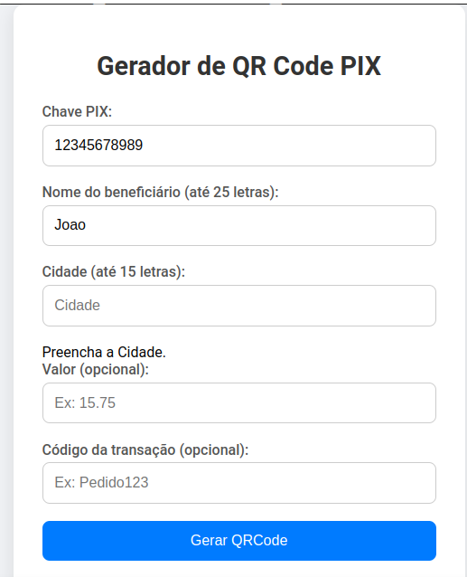

# Gerador de QR Code PIX (Banco do Brasil)

Este é um gerador simples de QR Code PIX baseado nas normas do Banco Central e compatível com o Banco do Brasil.

## ✨ Funcionalidades

- Geração de QR Code PIX de forma dinâmica
- Validação dos campos obrigatórios
- Interface simples e responsiva

## ▶️ Como usar

### Pré-requisitos

- Node.js instalado

### Instalação

Clone o repositório:

```bash
git clone https://github.com/walterpaulo/pix-gerador-qr-code.git
cd pix-gerador-qr-code

```

## Como usar

1. npm install.
2. npm run start.

## Exemplo



## Licença

MIT
